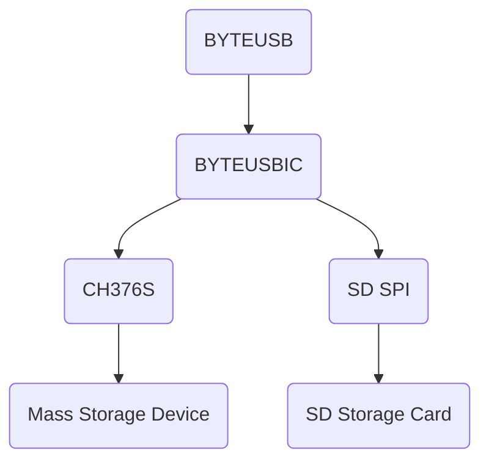

# ByteUSBIC
Byte-Store Serial File Browser.

ByteUSB offers the possibility to use a mass storage device, although these have been locked on the respective computer.
The data is transmitted purely serially, which is why most locks can be bypassed here.

**We assume no liability for loss of data or other damage to the system. The software is expressly for testing purposes only!**

### How it works as a diagram
