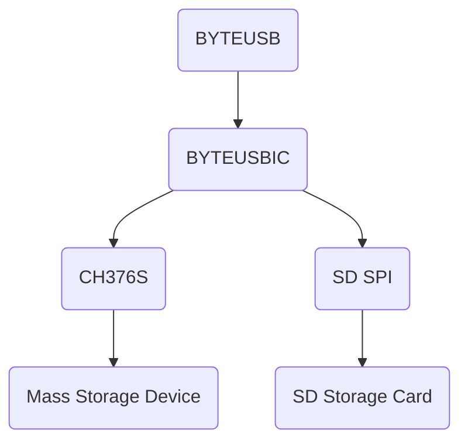

# ByteUSBIC 
#### (ByteUSB IC Slave)

Byte-Store Serial File Browser.

ByteUSB offers the possibility to use a mass storage device, although these have been locked on the respective computer.
The data is transmitted purely serially, which is why most locks can be bypassed here.

**We assume no liability for loss of data or other damage to the system. The software is expressly for testing purposes only!**

### How it works as a diagram


### Data Protocol Documentation (Response)

#### List Files / Directory's:
```json
{
  "cmd": "list",
  "data": {
    "files": [
      {
        "name": "test.txt",
        "type": "file",
        "size": 1200,
        "edited": "10.12.2022/12:21:23"
      },
      {
        "name": "discord.txt",
        "size": 248,
        "type": "file",
        "edited": "09.12.2022/08:19:45"
      },
      {
        "name": "teamspeak_slim",
        "type": "directory",
        "edited": "09.12.2022/02:09:12"
      }
    ]
  }
}
```

#### Delete File / Directory.
```json
{
  "cmd": "delete",
  "data": {
    "path": "teamspeak_client",
    "status": true
  }
}
```